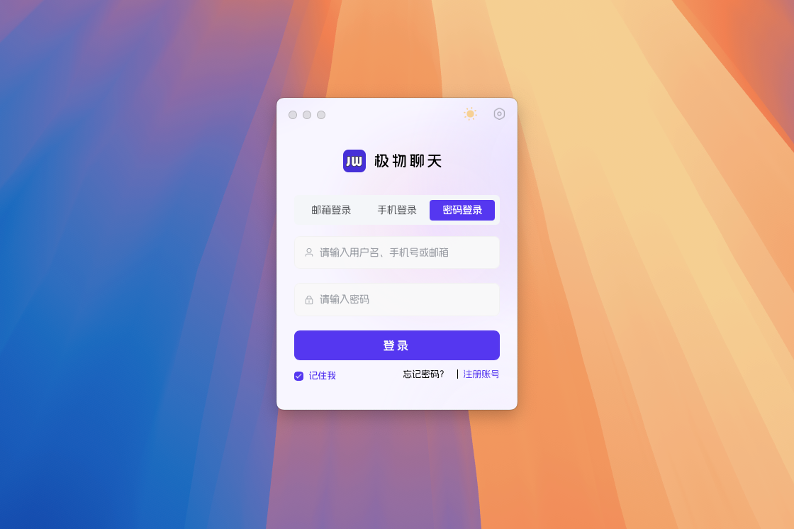
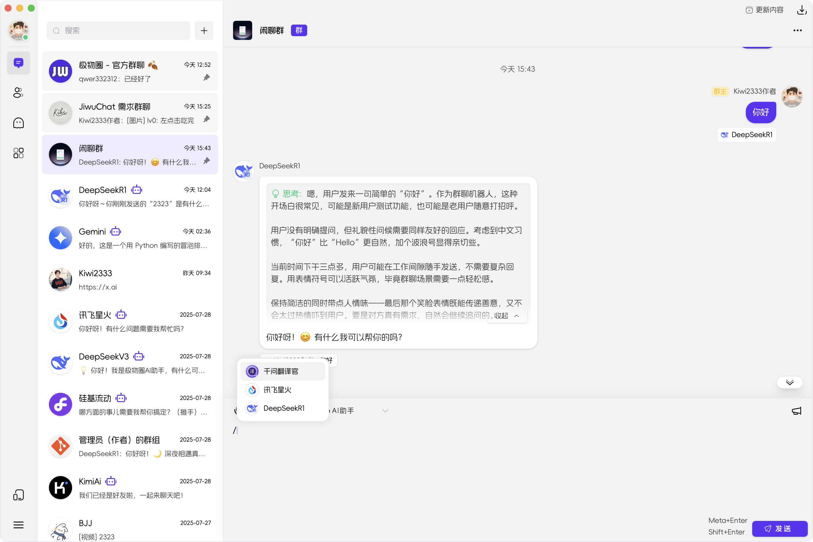
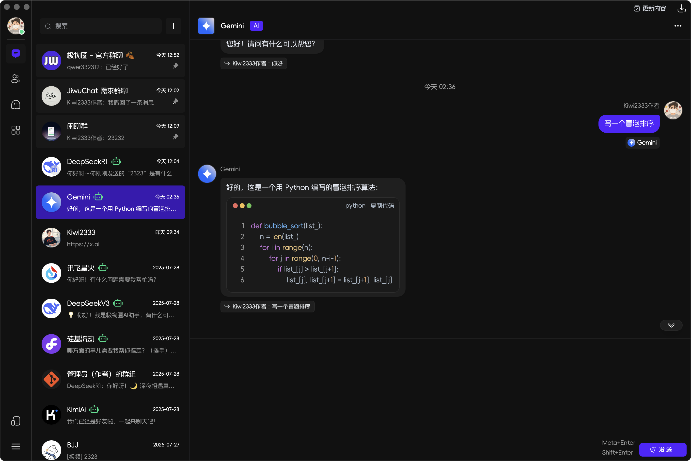
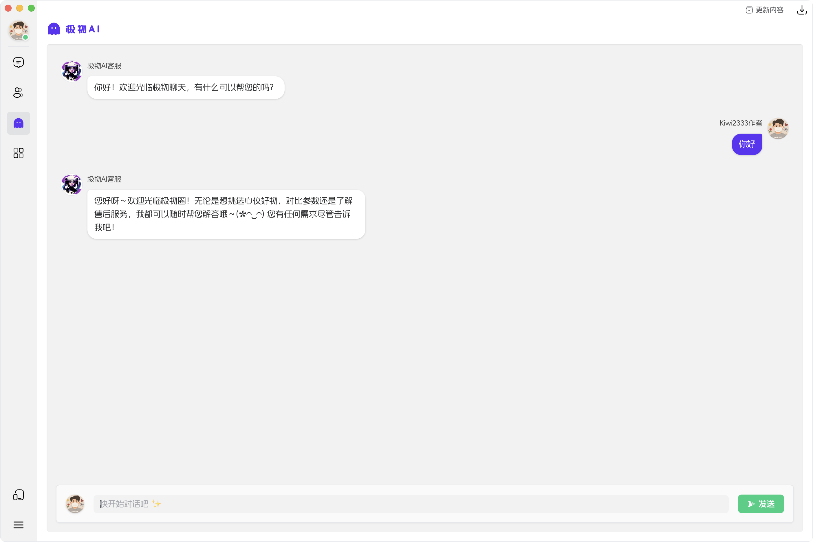
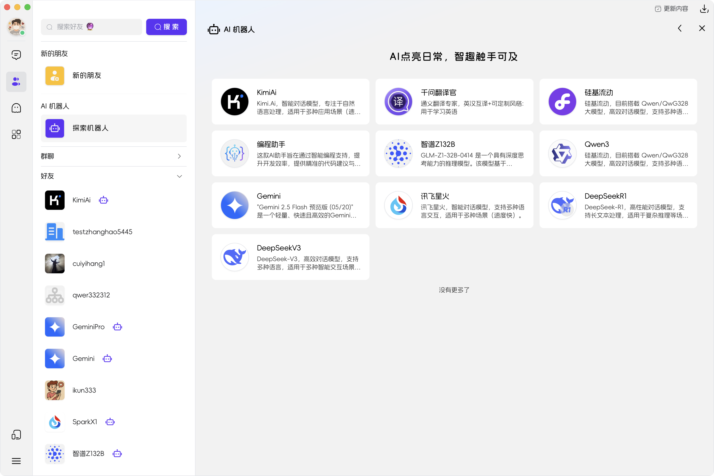
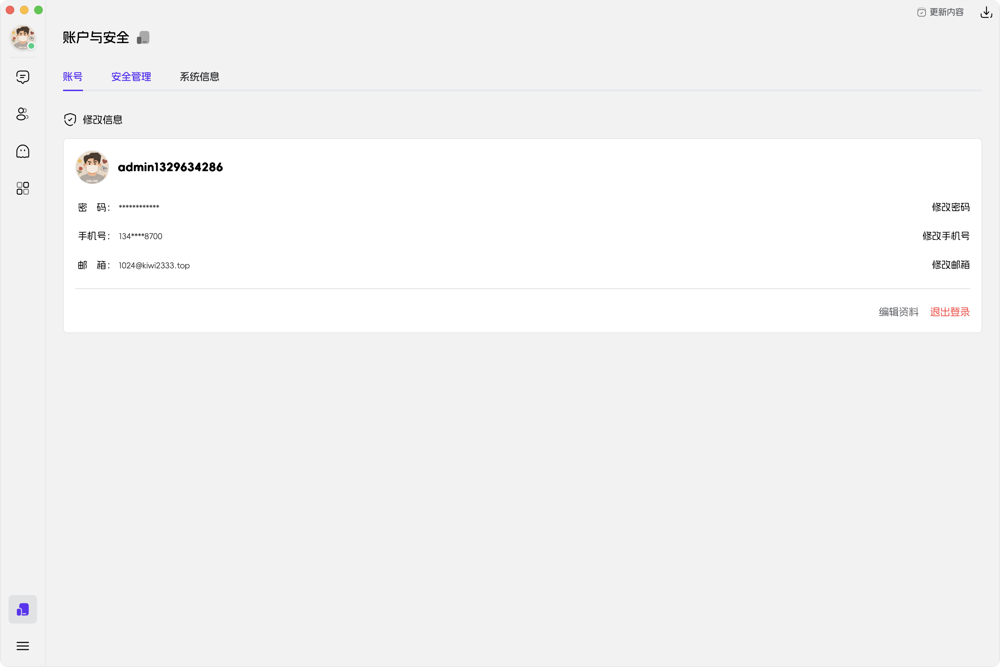
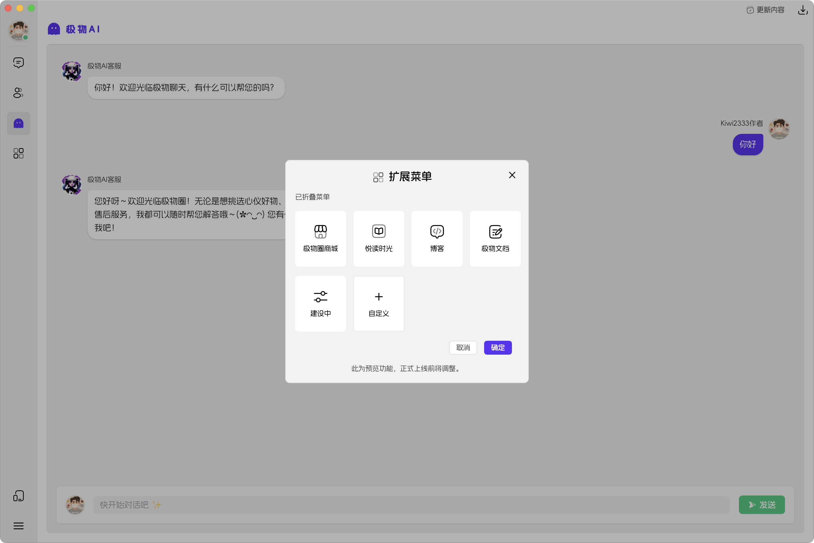
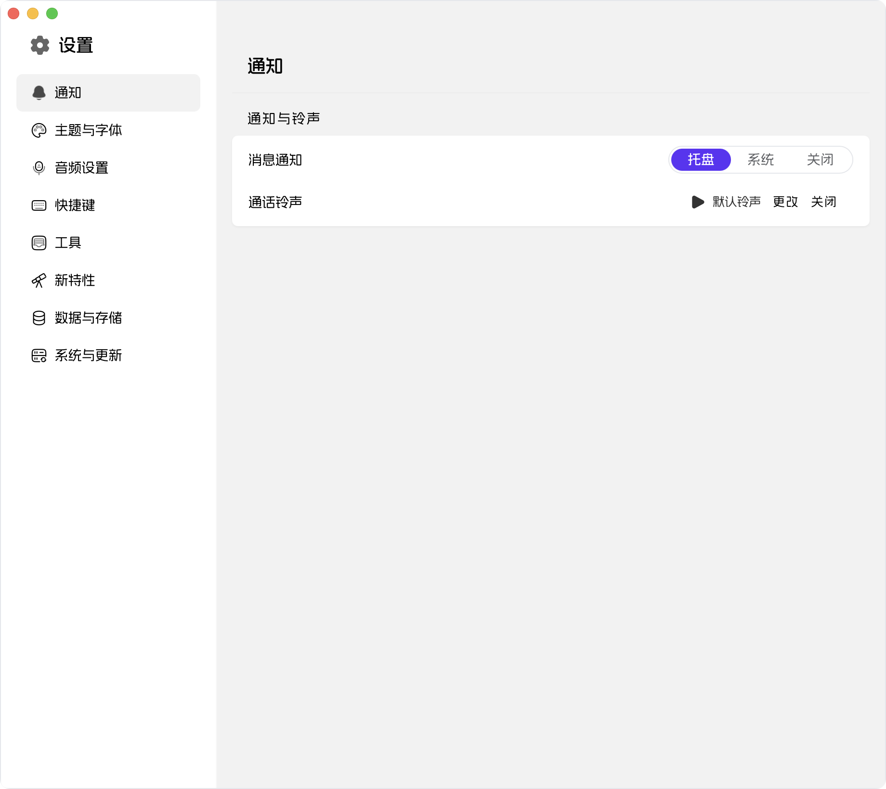
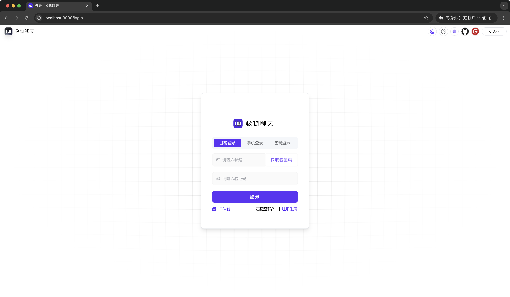

<div align=center>
 <div align=center margin="10em" style="margin:4em 0 0 0;font-size: 30px;letter-spacing:0.3em;">

 </div>
 <h2 align=center style="margin: 2em 0;">JiwuChat Tauri APP</h2>

<div>
      <a href="https://github.com/Kiwi233333/JiwuChat" target="_blank">
        
      </a>
      <a href="https://github.com/Kiwi233333/JiwuChat/stargazers" target="_blank">
        
      </a>
    </div>
    <div>
      <a href="https://github.com/Kiwi233333/JiwuChat/commits" target="_blank">
        
      </a>
      <a href="https://github.com/Kiwi233333/JiwuChat/issues" target="_blank">
        
      </a>
    </div>
    <div>
      <a href="`https://github.com/Kiwi233333/JiwuChat/blob/main/LICENSE`" target="_blank">
          
      </a>
      <a href="https://app.netlify.com/sites/jiwuchat/deploys" target="_blank">
          
      </a>
      <a href="https://qm.qq.com/q/iSaETNVdKw" target="_blank">
        
      </a>
    </div>
    <div>
      <a href="https://www.deepseek.com/" target="_blank" style="margin: 2px;">
        
      </a>
    </div>

Sitio Web Oficial: [JiwuChat](https://blog.jiwuchat.top/) <br> Idioma : [简体中文](../README.md) | [English](./README.en.md) | [Deutsch](./README.de.md) | **Español** | [Français](./README.fr.md) | [日本語](./README.ja.md) | [한국어](./README.ko.md) | [Português](./README.pt.md) | [Русский](./README.ru.md)

</div>

## Introducción

JiwuChat es una aplicación de chat multiplataforma ligera `(~10MB)` construida con Tauri2 y Nuxt3. Cuenta con varias capacidades de mensajería en tiempo real, bots de chat grupal con IA (`iFlytek Spark`, `KimiAI`, etc. integrados), `llamadas de audio/video WebRTC`, compartir pantalla y funcionalidad de compras con IA. Admite comunicación perfecta entre dispositivos con varios tipos de mensajes, incluidos texto, imágenes, archivos y voz. También admite chats grupales y configuraciones personalizables. Disponible en modos claro/oscuro para mejorar las redes sociales eficientes. ✨

## Una Base de Código, Soporte Multiplataforma


## Cuenta Predeterminada

- Usuario: ikun233
- Contraseña: 123456
- Pruébalo: [Versión Web](https://jiwuchat.top/)

> ⚠ Nota: ~~Esta cuenta tiene permisos limitados para cargas de archivos, modificaciones de perfil y cambios de contraseña. Es solo para fines de prueba.~~

> 👀 ¡Gracias por su apoyo! El proyecto aún está en desarrollo y el backend aún no es de código abierto. Agradecemos sus valiosos comentarios. Para cualquier pregunta, contáctenos por correo electrónico o QQ.

## Capturas de Pantalla del Proyecto

- 🖥️ **Escritorio**


















- 📱 **Adaptación Móvil**

<div>
 
 
 
 
 
 
 
 
 
 
 
 
 
</div>

- 🌐 **Web**



## 🌌 Funciones del Sistema


<details>
  <summary>Tabla de Funciones [Expandir/Contraer]</summary>

| Módulo                    | Submódulo                     | Descripción de Función                                                                                                                                 | Estado |
| ------------------------- | ----------------------------- | ------------------------------------------------------------------------------------------------------------------------------------------------------ | ------ |
| Módulo de Usuario         | Gestión de Cuentas            | Registro de usuario, inicio de sesión, selección de cuenta de inicio de sesión histórica                                                               | ✅     |
|                           | Seguridad de Cuenta           | Recordatorio de vinculación de correo/teléfono, gestión de dispositivos, verificación de seguridad de cuenta                                           | ✅     |
| Módulo de Mensajes        | Chat Básico                   | Mensajes de texto, mensajes de imagen, mensajes de video, cargas de archivos, retiro de mensajes, estado de lectura de mensajes                        | ✅     |
|                           | Sincronización de Datos       | Sincronización de mensajes entre dispositivos, sincronización del estado de lectura                                                                    | ✅     |
|                           | Chat Avanzado                 | Respuestas con citas, menciones @, anuncios, reeditar mensajes retirados                                                                               | ✅     |
| Módulo de Sesiones        | Gestión de Sesiones           | Lista de sesiones, anclar sesiones, ocultar sesiones, estadísticas de no leídos, ordenar sesiones                                                      | ✅     |
| Módulo de Chat Grupal     | Operaciones de Grupo          | Crear chat grupal, abandonar chat grupal, ver detalles del chat grupal                                                                                 | ✅     |
|                           | Gestión de Miembros del Grupo | Gestionar miembros del grupo, establecer administradores, revocar administradores, obtener lista @                                                     | ✅     |
| Módulo de Contactos       | Operaciones de Amigos         | Solicitudes de amistad, búsqueda de amigos, lista de amigos, rechazar solicitudes de amistad, eliminar amigos                                          | ✅     |
|                           | Perfil y Notificaciones       | Ver detalles de amigos, estadísticas de solicitudes no leídas                                                                                          | ✅     |
| Módulo de IA              | Funciones de Chat             | Chat privado con IA, chat grupal con IA, chat simultáneo con múltiples IA                                                                              | ✅     |
|                           | Gestión de Modelos            | Soporte para Gemini, Kimi AI, DeepSeek, Silicon Flow y otros proveedores, lista de modelos, cálculo de tokens                                          | ✅     |
|                           | Función Plaza                 | Exhibición de plaza de robots IA                                                                                                                       | ✅     |
| Módulo de Comunicación    | Llamadas de Audio/Video       | Llamadas de voz basadas en WebRTC, videollamadas, compartir pantalla                                                                                   | ✅     |
|                           | Historial de Llamadas         | Actualizaciones del estado de llamadas, registros de colgado                                                                                           | ✅     |
| Sistema de Notificaciones | Notificaciones de Mensajes    | Notificaciones de escritorio, alertas de bandeja del sistema, configuración de tonos, no molestar                                                      | ✅     |
| Funciones de Extensión    | Integración Integral          | Integración de tienda, integración de blog, panel de registro de actualizaciones                                                                       | ✅     |
| Otros Módulos             | Otras Funciones               | Funciones de chat social, funciones de compras con IA, gestión de descargas de archivos, herramientas de traducción (traducción IA/traducción Tencent) | ✅     |
|                           | Archivos y Reproducción       | Visor de imágenes, reproductor de video, descarga de archivos, carga de imágenes por lotes                                                             | ✅     |
|                           | Configuración de Tema         | Cambio de tema claro/oscuro, seguir tema del sistema, configuración de fuente, diseño adaptativo                                                       | ✅     |
|                           | Compatibilidad de Plataforma  | Adaptación para Windows, MacOS, Linux, Android, Web                                                                                                    | ✅     |

</details>

## ⏳ Desarrollo

### 📦 Requisitos Previos

- Requisitos previos y configuración [Documentación Oficial de Tauri](https://tauri.app/es/start/prerequisites/)

### ✨ Documentación

- Para documentación operativa detallada, consulte [Run.md](../Run.md)

### 🔧 Stack Tecnológico

| Categoría                                | Tecnología/Componente | Versión    |
| ---------------------------------------- | --------------------- | ---------- |
| Framework                                | Nuxt                  | ^3.14.159+ |
|                                          | Tauri                 | ^2.1.0     |
| Biblioteca de Componentes UI             | Element Plus          | ^2.8.4     |
| Gestión de Estado                        | Pinia                 | 2.1.7      |
| Biblioteca de Utilidades                 | Vueuse                | 10.11.0    |
| Herramientas de Compilación y Desarrollo | Nuxi                  | lts        |
|                                          | Vite                  | lts        |
| Calidad de Código                        | ESLint                | 8.56.0     |
|                                          | Prettier              | 3.3.2      |
| Verificación de Tipos                    | TypeScript            | 5.3.2      |
| Procesamiento de Estilos                 | Sass                  | 1.77.6     |

## ❓ Preguntas Frecuentes

- **Errores de Instalación en MacOS:**

<!-- Contraer -->
<details>
Al descargar e instalar este proyecto en macOS, puede encontrar mensajes como "El paquete de instalación está dañado" o problemas relacionados con certificados debido a los mecanismos de seguridad del sistema. Siga estos pasos:

1. Abra「Configuración del Sistema」-「Privacidad y Seguridad」y marque la opción para permitir que se ejecuten aplicaciones descargadas de "Cualquier lugar" (como se muestra en: img_10.png).
2. Si persisten los errores, ejecute los siguientes comandos en Terminal:

   **Antes de la instalación:**

   ```shell
   sudo xattr -rd com.apple.quarantine /ruta/al/instalador/nombre-del-instalador
   ```

   **Si ya está instalado:**

   ```shell
   sudo xattr -r -d com.apple.quarantine /Applications/NombreDeLaApp.app
   ```

</details>

- Para preguntas comunes, no dude en dejar un mensaje en la sección [Issues](https://github.com/KiWi233333/JiwuChat/Issues), o contáctenos a través de los métodos a continuación. Complementaremos y responderemos de inmediato.

## 🦾 Tendencias


## 💬 Contacto

- Correo electrónico: [kiwi2333@qq.com](mailto:kiwi2333@qq.com)
- QQ: [1329634286](https://wpa.qq.com/msgrd?v=3&uin=1329634286&site=qqq&menu=yes)
- Grupo QQ: [939204073](https://qm.qq.com/q/iSaETNVdKw)
